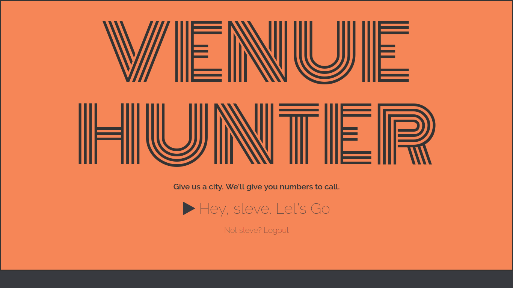
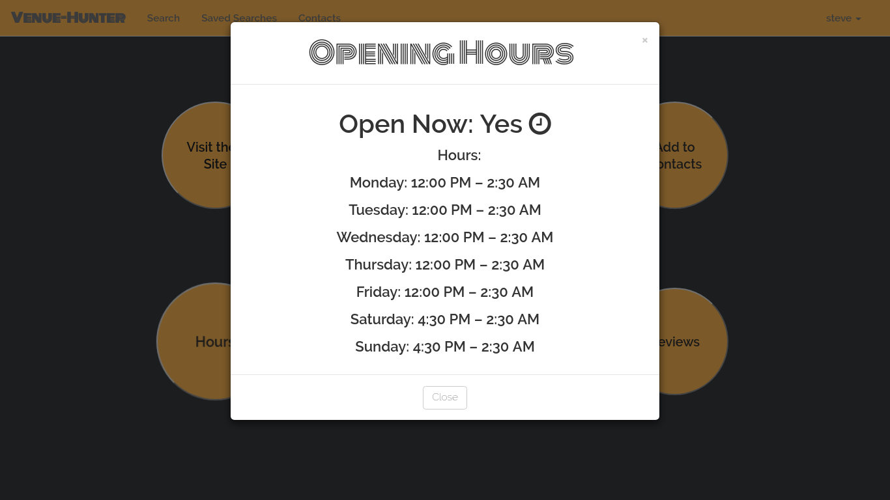
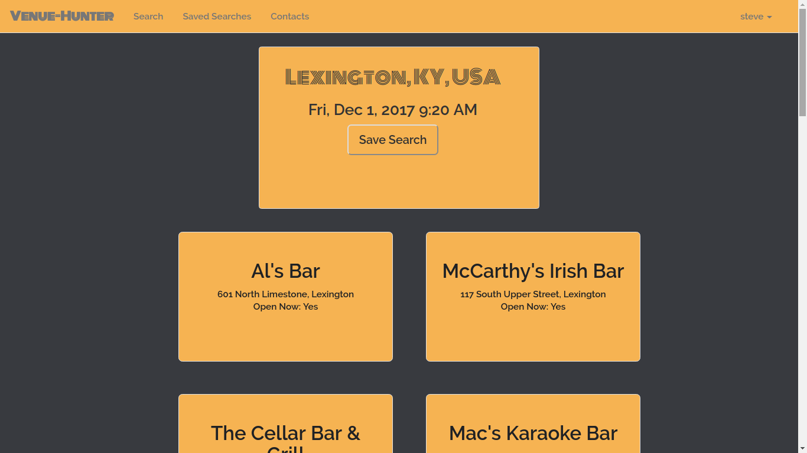
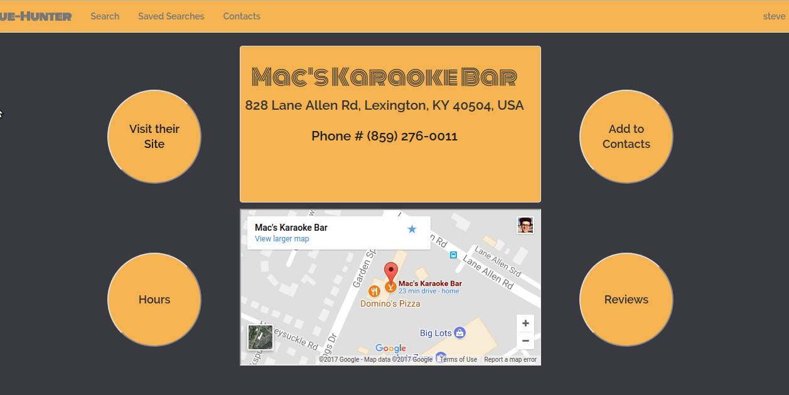
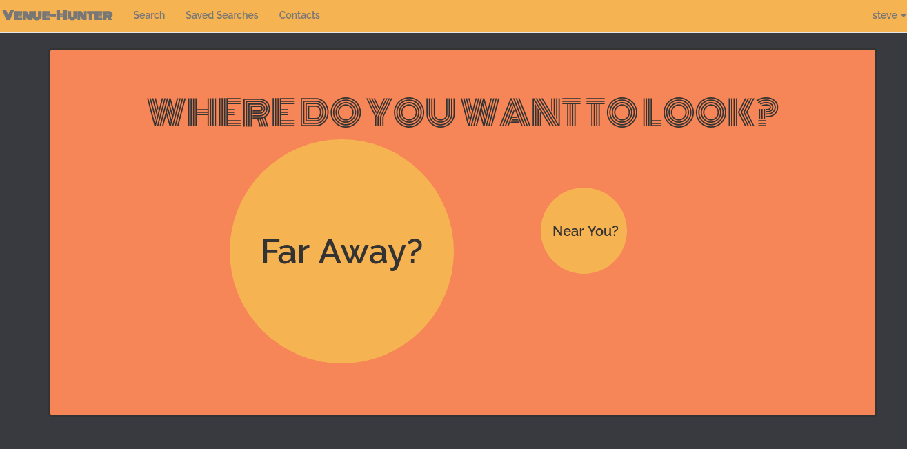

## Venue Hunter

Venue Hunter is an application designed to help bands find places to play. The intention is to make a ultra easy to use user interface with large colorful buttons - easy enough that even the drummer can figure it out. You can:
- search any city/state in the US
- search places close to you utilizing geolocation
- find contact information (phone#, website, map information) of venues
- save searches and contact information to a database under your logged in credentials

Technologies
------------

* PHP with the Laravel Framework [Laravel](https://laravel.com/docs/5.5/installation), [PHP](https://secure.php.net/)   
* postgreSQL for the database [link](https://www.postgresql.org/)   
* Guzzle Http Client (for the majority of api calls) [link](http://docs.guzzlephp.org/en/stable/)  
* Javascript (for calling the tricky google maps geolocation api) [link](https://www.javascript.com/)  

Screenshots:
-----------

ICONS:
----------
* Internet Browsing by Artdabana@Design from the Noun Project [link](https://thenounproject.com/search/?q=the%20internet&i=1438054)   
* Font Awesome [link](http://fontawesome.io/)  

API Credits:
---------
* Google Maps Geolocation: [link](https://developers.google.com/maps/documentation/javascript/examples/map-geolocation) 
* Google Maps Geocoding: [link](https://developers.google.com/maps/documentation/geocoding/intro) 
* Google Maps Embed API: [link](https://developers.google.com/maps/documentation/embed/) 
* Google Places Nearby Search: [link](https://developers.google.com/places/web-service/search) 
* Google Places Detail Search: [link](https://developers.google.com/places/web-service/details) 
* W3 Geolocation Standard: [link](https://dev.w3.org/geo/api/spec-source.html) 

CSS Libraries:
-------------
* Bootstrap 3.7: [link](https://getbootstrap.com/docs/3.3/)  
* Hover.css [link](http://ianlunn.github.io/Hover/)   

